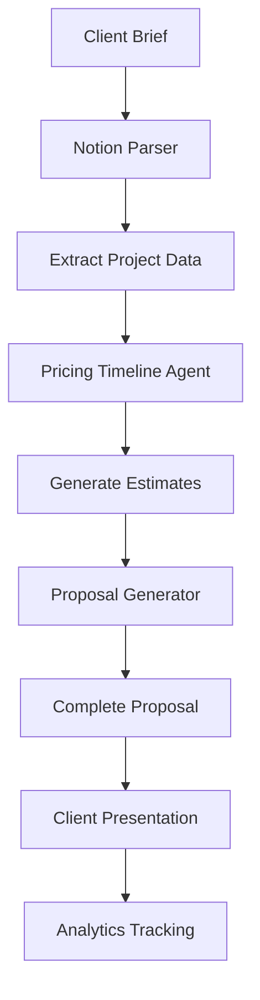

# AI Pricing Timeline Agent - Integration Guide

## 🔗 System Integration

### Integration with Existing Zapys AI Components

#### 1. **Proposal Generator Integration**
```typescript
// Enhanced proposal generation with pricing data
interface EnhancedProposalRequest {
  projectData: ProjectData
  userPreferences: UserPreferences
  pricingData?: PricingTimelineResponse // From pricing agent
}

// Workflow:
// 1. Run pricing agent first to get estimates
// 2. Pass pricing data to proposal generator
// 3. Generate cohesive proposal with accurate pricing
```

#### 2. **Notion Parser Integration**
```typescript
// Extract project data from Notion for pricing analysis
const notionData = await notionParser.extractProjectData(notionUrl)
const pricingRequest = {
  projectData: {
    title: notionData.title,
    description: notionData.description,
    deliverables: notionData.deliverables,
    complexity: determineComplexity(notionData.requirements)
  },
  clientData: notionData.clientInfo,
  marketData: getMarketData(notionData.clientInfo.location)
}
```

#### 3. **Analytics Engine Integration**
```typescript
// Track pricing accuracy and win rates
interface PricingAnalytics {
  proposalId: string
  estimatedPrice: number
  actualPrice?: number
  estimatedTimeline: number
  actualTimeline?: number
  won: boolean
  clientFeedback?: string
}

// Use analytics to improve pricing accuracy over time
```

## 🔄 Workflow Examples

### Complete Project Estimation Workflow


### API Integration Pattern
```typescript
// Express.js route example
app.post('/api/generate-estimate', async (req, res) => {
  try {
    // 1. Parse input data
    const { notionUrl, clientInfo, projectRequirements } = req.body
    
    // 2. Extract project data if Notion URL provided
    let projectData = projectRequirements
    if (notionUrl) {
      projectData = await notionParser.extract(notionUrl)
    }
    
    // 3. Generate pricing and timeline
    const pricingEstimate = await pricingAgent.generate({
      projectData,
      clientData: clientInfo,
      marketData: await getMarketData(clientInfo.location)
    })
    
    // 4. Generate proposal with pricing
    const proposal = await proposalGenerator.generate({
      projectData,
      userPreferences: req.user.preferences,
      pricingData: pricingEstimate
    })
    
    // 5. Track for analytics
    await analytics.track({
      userId: req.user.id,
      action: 'estimate_generated',
      data: { pricingEstimate, proposal }
    })
    
    res.json({
      success: true,
      estimate: pricingEstimate,
      proposal: proposal
    })
    
  } catch (error) {
    res.status(500).json({ success: false, error: error.message })
  }
})
```

## 📊 Database Schema Extensions

### New Tables for Pricing Data
```sql
-- Pricing estimates table
CREATE TABLE pricing_estimates (
  id UUID PRIMARY KEY DEFAULT gen_random_uuid(),
  project_id UUID REFERENCES projects(id),
  total_price DECIMAL(10,2) NOT NULL,
  currency VARCHAR(3) DEFAULT 'USD',
  breakdown JSONB NOT NULL,
  timeline_weeks INTEGER NOT NULL,
  confidence_score DECIMAL(3,2),
  market_position VARCHAR(20),
  created_at TIMESTAMP DEFAULT NOW(),
  updated_at TIMESTAMP DEFAULT NOW()
);

-- Timeline phases table
CREATE TABLE timeline_phases (
  id UUID PRIMARY KEY DEFAULT gen_random_uuid(),
  estimate_id UUID REFERENCES pricing_estimates(id),
  phase_name VARCHAR(100) NOT NULL,
  weeks DECIMAL(3,1) NOT NULL,
  description TEXT,
  dependencies TEXT[],
  deliverables TEXT[],
  phase_order INTEGER NOT NULL
);

-- Risk factors table
CREATE TABLE risk_factors (
  id UUID PRIMARY KEY DEFAULT gen_random_uuid(),
  estimate_id UUID REFERENCES pricing_estimates(id),
  category VARCHAR(20) NOT NULL, -- 'technical', 'timeline', 'budget'
  description TEXT NOT NULL,
  severity VARCHAR(10) DEFAULT 'medium', -- 'low', 'medium', 'high'
  mitigation TEXT
);
```

## 🎛️ Configuration Options

### Environment Variables
```bash
# Pricing agent configuration
PRICING_AGENT_DEFAULT_CURRENCY=USD
PRICING_AGENT_VAT_RATE=0.20
PRICING_AGENT_DEFAULT_BUFFER=0.15
PRICING_AGENT_MIN_CONFIDENCE=0.6

# Regional rate adjustments
PRICING_UKRAINE_MULTIPLIER=0.6
PRICING_POLAND_MULTIPLIER=0.7
PRICING_WESTERN_EUROPE_MULTIPLIER=1.2
PRICING_US_MULTIPLIER=1.5

# Market data sources
MARKET_DATA_API_KEY=your_api_key
MARKET_DATA_UPDATE_INTERVAL=24h
```

### Frontend Integration
```typescript
// React component example
const PricingEstimator: React.FC = () => {
  const [estimate, setEstimate] = useState<PricingTimelineResponse | null>(null)
  const [loading, setLoading] = useState(false)
  
  const generateEstimate = async (projectData: ProjectData) => {
    setLoading(true)
    try {
      const response = await fetch('/api/generate-estimate', {
        method: 'POST',
        headers: { 'Content-Type': 'application/json' },
        body: JSON.stringify(projectData)
      })
      const result = await response.json()
      setEstimate(result.estimate)
    } catch (error) {
      console.error('Failed to generate estimate:', error)
    } finally {
      setLoading(false)
    }
  }
  
  return (
    <div className="pricing-estimator">
      {estimate && (
        <PricingBreakdown 
          pricing={estimate.pricing}
          timeline={estimate.timeline}
          confidence={estimate.confidence}
          recommendations={estimate.recommendations}
        />
      )}
    </div>
  )
}
```

## 🚀 Deployment Considerations

### Performance Optimization
- Cache market data for 24 hours
- Pre-calculate common project templates
- Use database indexes on frequently queried fields
- Implement rate limiting for API endpoints

### Monitoring & Alerts
- Track pricing accuracy vs. actual project costs
- Monitor confidence scores and adjust algorithms
- Alert on significant market rate changes
- Track client acceptance rates by price range

### Security
- Validate all input data
- Sanitize client information
- Encrypt sensitive pricing data
- Implement proper authentication for API access

This integration enables the Zapys AI platform to provide comprehensive, data-driven project estimates that improve win rates and project profitability.